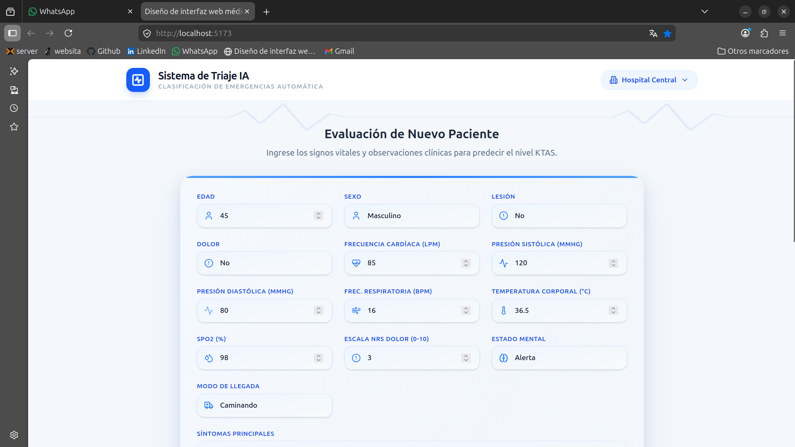
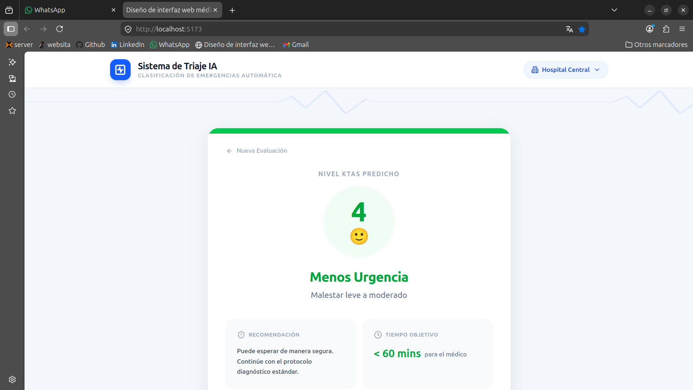

# 🏥 Triage Automático con IA

<div align="center">

[](https://www.python.org)
[](https://scikit-learn.org)
[](https://react.dev)
[](LICENSE)

**Sistema Inteligente de Clasificación Médica (KTAS) mediante Machine Learning**

Proyecto académico de IA que entrena y compara múltiples modelos de ML para automatizar el triaje de pacientes en emergencias

[📊 Metodología](#-metodología) • [🤖 Modelos Evaluados](#-modelos-evaluados) • [📈 Resultados](#-resultados) • [🚀 Quick Start](#-quick-start)

</div>

---

## 🎯 Descripción General

Este es un **proyecto académico de Machine Learning** que estudia y compara diferentes algoritmos de clasificación para automatizar el triaje médico KTAS.

El trabajo incluye:

- 📊 **Análisis exploratorio** de datos clínicos de 1,267 pacientes
- 🔬 **Limpieza y preprocesamiento** de variables categóricas y numéricas
- 🤖 **Entrenamiento y evaluación** de 5 modelos ML diferentes
- 📈 **Comparación de rendimiento** mediante métricas estándar de ML
- 🎨 **Interfaz visual** para demostración del modelo elegido

### ¿Qué es el Triage KTAS?

El **Sistema Monárquico Canadiense de Triage (KTAS)** clasifica pacientes en 5 niveles de urgencia:


| Nivel | Urgencia          | Descripción                            | Tiempo Espera |
| ----- | ----------------- | --------------------------------------- | ------------- |
| **1** | 🔴 Resucitación  | Estado crítico, riesgo vital inmediato | Inmediato     |
| **2** | 🟠 Emergencia     | Muy urgente, evaluación inmediata      | 10-15 min     |
| **3** | 🟡 Urgencia       | Urgente, evaluación rápida            | 30-60 min     |
| **4** | 🟢 Menos Urgencia | Semiurgente                             | 1-2 horas     |
| **5** | 🔵 No Urgencia    | No urgente                              | 2-4 horas     |

---

## 📊 Metodología

### 1️⃣ **Fuente de Datos**

<div align="center">

**Dataset:** Emergency Service Triage Application (Kaggle)

- 📋 **1,267 registros** de pacientes adultos
- 📅 **Período:** Octubre 2016 - Septiembre 2017
- 🏥 **Ubicación:** 2 departamentos de emergencias
- ✅ **Validación:** 3 expertos en triage KTAS
- 📊 **24 variables** clínicas y demográficas

</div>

### 2️⃣ **Variables Utilizadas**

#### Datos Demográficos

- **Sex:** Sexo del paciente (Femenino/Masculino)
- **Age:** Edad en años
- **Arrival mode:** Modo de llegada (A pie, Ambulancia pública/privada, Otros)

#### Signos Vitales (medidos en el triaje inicial)

- **HR:** Frecuencia Cardíaca (latidos/min)
- **SBP:** Presión Sistólica (mmHg)
- **DBP:** Presión Diastólica (mmHg)
- **RR:** Frecuencia Respiratoria (resp/min)
- **BT:** Temperatura Corporal (°C)
- **Saturation:** Saturación de Oxígeno (%)

#### Evaluación Clínica

- **Mental:** Estado mental (Alerta, Respuesta verbal, Respuesta al dolor, Sin respuesta)
- **Pain:** Presencia de dolor (Sí/No)
- **NRS_pain:** Escala de dolor numérica (0-10)
- **Chief_complain:** Motivo principal de consulta
- **Injury:** Presencia de lesión traumática

### 3️⃣ **Preprocesamiento de Datos**

```
┌─────────────────────────────────────────┐
│      DATOS CRUDOS (1,267 registros)     │
└────────────────┬────────────────────────┘
                 │
                 ▼
┌─────────────────────────────────────────┐
│  ✓ Eliminación de registros incompletos │
│  ✓ Tratamiento de valores atípicos       │
│  ✓ Imputación de datos faltantes         │
│  ✓ Normalización de texto                │
│  ✓ Codificación de variables categóricas │
└────────────────┬────────────────────────┘
                 │
                 ▼
┌─────────────────────────────────────────┐
│   DATOS LIMPIOS Y PROCESADOS            │
│   Train (80%): 1,013 registros          │
│   Test (20%):  254 registros            │
└─────────────────────────────────────────┘
```

### 4️⃣ **Técnicas Aplicadas**


| Técnica             | Descripción                            | Aplicación                                |
| -------------------- | --------------------------------------- | ------------------------------------------ |
| **One-Hot Encoding** | Codificación de variables categóricas | Chief_complain, Mental, Arrival mode, etc. |
| **StandardScaler**   | Normalización de escala                | Signos vitales (HR, SBP, RR, BT)           |
| **Train-Test Split** | Partición 80-20 estratificada          | Validación del modelo                     |
| **Cross-Validation** | Validación cruzada (5-folds)           | Evaluación robusta de hiperparámetros    |
| **GridSearchCV**     | Búsqueda de hiperparámetros óptimos  | Tuning de modelos complejos                |

---

## 🤖 Modelos Evaluados

Se entrenaron y compararon **5 modelos de clasificación multiclase**:

### 1. **Regresión Logística Multiclase**

- ✅ **Ventajas:** Interpretabilidad, entrenamiento rápido
- ❌ **Limitaciones:** Asume relaciones lineales
- 📊 **Aplicación:** Baseline de referencia

### 2. **Support Vector Machine (SVM)**

- ✅ **Ventajas:** Eficaz en espacios multidimensionales
- 🔧 **Hiperparámetros ajustados:** Kernel, C, γ
- ⚖️ **Balanceo:** class_weight="balanced" para clases desbalanceadas

### 3. **Red Neuronal Artificial (RNA)**

- ✅ **Ventajas:** Captura relaciones no-lineales complejas
- 🏗️ **Arquitectura:** Capas ocultas ajustables
- 📚 **Optimización:** Early stopping y validación cruzada

### 4. **Random Forest**

- ✅ **Ventajas:** Robustez, manejo de variables heterogéneas
- 🌲 **Características:** Ensemble de árboles de decisión
- 🎯 **Feature importance:** Identifica variables más relevantes

### 5. **Gradient Boosting / XGBoost**

- ✅ **Ventajas:** Precisión muy alta, construcción secuencial
- ⚡ **Eficiencia:** Optimizado para rendimiento
- 📈 **Complejidad:** Requiere más tuning

---

## 📈 Resultados

### Matriz de Confusión - Modelo Seleccionado


### Métricas Generales


### Precisión por Clase

**Clase 1 (Nivel Crítico - Resucitación)**


**Clase 2 (Nivel Emergencia)**


---

## 🎨 Interfaz Visual

La aplicación incluye un formulario interactivo para demostración del modelo entrenado:



### Pantalla de Resultados



---

## ✨ Características

- 🔬 **Análisis ML Completo:** Desde exploración hasta validación
- 🤖 **Comparación de Modelos:** 5 algoritmos diferentes
- 📊 **Métricas Detalladas:** Accuracy, Precision, Recall, F1-Score
- 💻 **Interfaz Moderna:** React + TypeScript + Tailwind CSS
- 📱 **Diseño Responsive:** Funciona en desktop, tablet y móvil
- 📈 **Visualizaciones:** Matrices de confusión, gráficos ECG
- 🔐 **Tipado Completo:** TypeScript para mayor seguridad

---

## 🚀 Quick Start

### Requisitos Previos

- **Python** 3.10+ ([descargar](https://www.python.org))
- **Jupyter Notebook** (incluido en anaconda)
- **Git** ([descargar](https://git-scm.com))

### 1. Clonar el Repositorio

```bash
git clone https://github.com/IngenieroAlejandroRoa/Triage-Automatico---IA.git
cd Triage-Automatico---IA
```

### 2. Configurar Entorno Python

```bash
# Crear entorno virtual
python -m venv venv

# Activar entorno virtual
# En macOS/Linux:
source venv/bin/activate
# En Windows:
venv\Scripts\activate

# Instalar dependencias
pip install -r requirements.txt
```

### 3. Ejecutar Análisis ML (Notebook Principal)

```bash
# Inicia Jupyter
jupyter notebook Triage_Automatico_Proyecto_IA.ipynb
```

**El notebook incluye:**

- ✅ Carga y exploración de datos
- ✅ Limpieza y preprocesamiento
- ✅ Entrenamiento de 5 modelos
- ✅ Evaluación y comparación
- ✅ Visualización de resultados
- ✅ Guardado del mejor modelo

### 4. (Opcional) Interfaz Visual - Frontend

```bash
# Solo si deseas ver la interfaz visual de demostración
cd Frontend
npm install
npm run dev
```

➡️ **Frontend disponible en**: `http://localhost:5173`

---

## 📁 Estructura del Proyecto

```
Triage-Automatico---IA/
│
├── 📊 Triage_Automatico_Proyecto_IA.ipynb    ⭐ ARCHIVO PRINCIPAL
│   └── Notebook con análisis ML completo
│
├── 📁 Modelos/                               # Modelos entrenados guardados
│
├── 📁 Images/                                # Visualizaciones y gráficos
│   ├── Matrices de confusion.png
│   ├── Metricas generales.png
│   ├── precision clase 1.png
│   ├── precision clase 2.png
│   ├── Formulario.png
│   └── Triage.png
│
├── 📁 Frontend/                              # Interfaz visual (React)
│   ├── src/
│   │   ├── components/
│   │   │   ├── TriageForm.tsx
│   │   │   ├── TriageResult.tsx
│   │   │   └── ECGLine.tsx
│   │   └── main.tsx
│   ├── package.json
│   └── vite.config.ts
│
├── 📄 data.csv                               # Dataset de entrenamiento (1,267 registros)
├── 📄 requirements.txt                       # Dependencias Python
├── 📄 README.md                              # Este archivo
└── 📄 LICENSE                                # Licencia MIT
```

---

## 🛠️ Tech Stack

### Backend / Machine Learning

```
Python 3.12              - Lenguaje principal
Jupyter Notebook         - Análisis interactivo
Pandas & NumPy          - Manipulación de datos
Scikit-Learn 1.6+       - Algoritmos ML
  ├── LogisticRegression - Regresión logística
  ├── SVM               - Máquinas de soporte vectorial
  ├── RandomForest      - Bosques aleatorios
  ├── GradientBoosting  - Gradient Boosting
  └── Métricas          - Evaluación de modelos
XGBoost                 - Gradient Boosting optimizado
Matplotlib              - Visualización de datos
```

### Frontend (UI Demostrativa)

```
React 18.3.1            - Librería UI
TypeScript              - Tipado estático
Vite 6.3.5             - Build tool
Tailwind CSS 4.1.12    - Utility-first CSS
Shadcn/UI              - Componentes accesibles
Recharts 2.15.2        - Gráficos interactivos
```

---

## 📊 Flujo del Proyecto

```
┌─────────────────────────────────────────────────────────────┐
│            PACIENTE (DATOS CLÍNICOS)                        │
│  - Signos vitales (HR, SBP, RR, BT, SpO2)                 │
│  - Estado mental                                            │
│  - Nivel de dolor                                           │
│  - Datos demográficos                                       │
└────────────────────┬────────────────────────────────────────┘
                     │
                     ▼
┌─────────────────────────────────────────────────────────────┐
│            PREPROCESAMIENTO                                  │
│  ✓ Limpieza de datos                                        │
│  ✓ Imputación de faltantes                                  │
│  ✓ Codificación de categorías (One-Hot)                    │
│  ✓ Normalización (StandardScaler)                           │
└────────────────────┬────────────────────────────────────────┘
                     │
                     ▼
┌─────────────────────────────────────────────────────────────┐
│            MODELOS ML ENTRENADOS                            │
│  • Logistic Regression   • SVM                              │
│  • Random Forest        • Gradient Boosting                │
│  • Neural Network                                           │
└────────────────────┬────────────────────────────────────────┘
                     │
                     ▼
┌─────────────────────────────────────────────────────────────┐
│            PREDICCIÓN: NIVEL KTAS (1-5)                    │
│  🔴 Resucitación  🟠 Emergencia  🟡 Urgencia              │
│  🟢 Menos Urgencia  🔵 No Urgencia                          │
└────────────────────┬────────────────────────────────────────┘
                     │
                     ▼
┌─────────────────────────────────────────────────────────────┐
│            INTERFAZ VISUAL (Opcional)                       │
│  - Resultado de clasificación                               │
│  - Métricas de confianza                                    │
│  - Recomendaciones de prioridad                             │
└─────────────────────────────────────────────────────────────┘
```

---

## 🎯 Uso Práctico

### Para Investigadores / Estudiantes de ML

- 📚 Aprender sobre comparación de algoritmos
- 🔬 Entender preprocesamiento de datos médicos
- 📊 Analizar métricas de clasificación multiclase
- 🧪 Practicar validación cruzada y tuning de hiperparámetros

### Para Profesionales de Salud (Educativo)

- 🏥 Comprender principios de KTAS
- 📖 Aprender sobre automatización de triaje
- 💡 Ver aplicaciones de ML en salud

⚠️ **Disclaimer:** Este es un proyecto académico. No es para uso clínico sin validación profesional.

---

## 📚 Comandos Principales

### Análisis ML (Notebook)

```bash
# Ejecutar todo el análisis
jupyter notebook Triage_Automatico_Proyecto_IA.ipynb

# Alternativamente, modo batch
jupyter nbconvert --to notebook --execute Triage_Automatico_Proyecto_IA.ipynb
```

### Frontend (Opcional)

```bash
cd Frontend
npm run dev        # Desarrollo con hot reload
npm run build      # Build para producción
npm run preview    # Previsualizar build
```

---

## 👥 Autores

**Proyecto colaborativo desarrollado por:**

- **Ingeniero Alejandro Roa**
- **Alisson Navarro**
- **Laura Holguín**

📧 **Contacto:** alejoroaaparicio@gmail.com

🐙 **GitHub:** [@IngenieroAlejandroRoa](https://github.com/IngenieroAlejandroRoa)

---

## 📝 Referencias

- 📊 **Dataset:** [Emergency Service Triage Application - Kaggle](https://www.kaggle.com/datasets/ilkeryildiz/emergency-service-triage-application)
- 🏥 **KTAS:** Sistema Canadiense de Triage Monárquico (Canadian Triage Acuity Scale)
- 🔬 **Librerías:** Scikit-Learn, XGBoost, Pandas, Jupyter

## 📄 Licencia

Este proyecto está bajo la licencia MIT. Ver [`LICENSE`](LICENSE) para más detalles.

---

## 📞 Soporte & Contacto

¿Preguntas, sugerencias o problemas?

- 📧 Email: alejoroaaparicio@gmail.com
- 🐛 [Issues en GitHub](https://github.com/IngenieroAlejandroRoa/Triage-Automatico---IA/issues)
- 💬 [Discussions](https://github.com/IngenieroAlejandroRoa/Triage-Automatico---IA/discussions)

---

<div align="center">

**⭐ Si este proyecto fue útil para tu aprendizaje, considera darle una estrella en GitHub**

```
╔════════════════════════════════════════════════════════════╗
║  🏥 Triage Automático con IA - Proyecto Académico        ║
║  Machine Learning para Clasificación Médica (KTAS)       ║
║  Hecho con ❤️ por Ingeniero Alejandro Roa               ║
╚════════════════════════════════════════════════════════════╝
```

</div>
